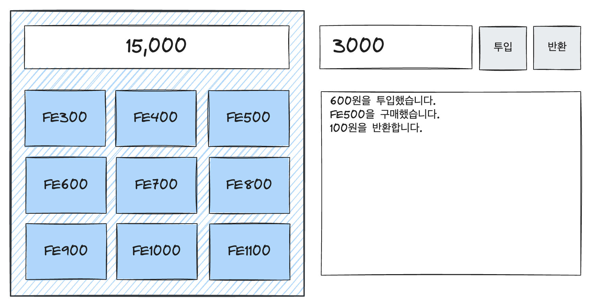
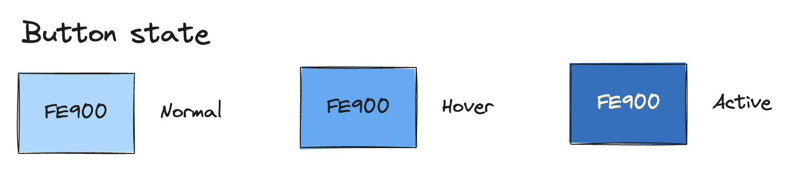

# fe1-vending-machine

자판기 애플리케이션 과제. 바닐라 자바스크립트 버전으로 단순한 자판기를 구현하는 과제입니다.

## 요구 사항

> ⚠️ Note: 명시적으로 요구하지 않은 시각적인 요소는 자유롭게 구현해도 좋습니다.

다음과 같이 상자 안에 3x3 형태로 상품 버튼이 배열되고, 버튼 상단에는 금액을 표시하는 화면이 있습니다. 자판기 오른쪽으로 배치된 입력 란에 숫자를 입력한 후 `투입` 버튼을 클릭하면 금액이 증가합니다. 상품 버튼을 클릭하면 상품이 구입되고, 상품 금액만큼 잔액에서 차감합니다.

상품 버튼은 다음과 같이 세 가지 상태로 나뉘어 표현됩니다. 색상은 화면과 일치하지 않아도 상관없습니다.

그 밖에 주의해야 할 구현 사항은 다음과 같습니다.

- 금액은 양수만 입력할 수 있습니다.
- 버튼 상단 금액 표시창의 기본값은 `0`입니다.
- 상품 버튼의 금액은 300원부터 1100원까지 100원 단위로 증가합니다. 편의상 상품 이름에는 금앰이 포함되어 `FE300` 등으로 표시합니다.
- 금액 표시창의 숫자는 중간 정렬되고 세 자리마다 쉼표(,)를 표시합니다.
- 모든 동작은 금액 투입 입력란 하단에 배치된 로그창에 기록합니다. 로그는 아래에 있을수록 최신 로그입니다.
- 상품 구입 후 잔액이 상품의 최소가보다 작으면 잔액이 자동으로 반환됩니다.

❗추가 스펙 - 7월 20일, 질문과 대화를 통해서 추가된 스펙

- 상품 버튼을 눌렀을 때 투입된 금액이 상품 가격보다 적으면 버튼을 누르는 동안 금액 표시창에 상품의 가격이 표시됩니다. 버튼을 누르지 않을 때는 투입된 금액이 표시됩니다.
- 금액을 투입하고 난 다음에는 금액 입력창을 빈 칸으로 초기화합니다.
- 박스 크기보다 로그가 길어지면 스크롤됩니다. 또한 가장 마지막 로그까지 스크롤이 이동합니다.
- [선택사항] 반응형 화면을 구성합니다.
  - 화면이 작아지면 자판기 박스 아래에 금액 투입 및 로그 UI가 위치합니다.
  - 자판기 박스의 너비는 화면 너비를 넘을 수 없습니다.

## 추가 프로젝트 (선택사항)

- 위 구현을 모두 만족하셨다면 본인이 가장 자신있는 프레임워크를 사용하여 동일한 기능을 구현해보세요.
- 프레임워크를 사용한 버전은 다른 브랜치에서 작업해주세요. 예) `seojihun-react`

## 작업 시 주의 사항

- 개인 이름으로 메인 브랜치를 포크해서 작업을 시작합니다. 예) `seojihun`
- Node.js 프로젝트를 신규로 설정하고, 개인별로 PR을 공개적으로 먼저 작성한 후에 작업을 시작합니다. 이때 PR은 Draft 상태로 설정해두세요.
- 최소 기능 단위로 완성할 때마다 커밋합니다.
- 자바스크립트에는 아무런 라이브러리를 사용할 수 없습니다.
- 빌드 툴은 자유롭게 선택할 수 있습니다.
- CSS 작성은 라이브러리나 프레임워크를 사용해도 괜찮습니다.

## 체크 리스트

- [x] 프로젝트 세팅
- [ ] 자판기 ui 제작
  - [ ] 버튼 상단 금액 표시창의 기본값은 0입니다.
  - [x] 상품 버튼의 금액은 300원부터 1100원까지 100원 단위로 증가합니다. 편의상 상품 이름에는 금앰이 포함되어 FE300 등으로 표시합니다.
  - [x] 금액 표시창의 숫자는 중간 정렬되고 세 자리마다 쉼표(,)를 표시합니다.
  - [ ] 박스 크기보다 로그가 길어지면 스크롤됩니다. 또한 가장 마지막 로그까지 스크롤이 이동합니다.
- [ ] 자판기 동작 구현
  - [ ] 금액은 양수만 입력할 수 있습니다.
  - [ ] 모든 동작은 금액 투입 입력란 하단에 배치된 로그창에 기록합니다. 로그는 아래에 있을수록 최신 로그입니다.
  - [ ] 상품 구입 후 잔액이 상품의 최소가보다 작으면 잔액이 자동으로 반환됩니다.
  - [x] 상품 버튼을 눌렀을 때 투입된 금액이 상품 가격보다 적으면 버튼을 누르는 동안 금액 표시창에 상품의 가격이 표시됩니다. 버튼을 누르지 않을 때는 투입된 금액이 표시됩니다.
  - [ ] 금액을 투입하고 난 다음에는 금액 입력창을 빈 칸으로 초기화합니다.

## 선택사항

- [ ] 반응형 화면을 구성합니다.
- [ ] 화면이 작아지면 자판기 박스 아래에 금액 투입 및 로그 UI가 위치합니다.
- [ ] 자판기 박스의 너비는 화면 너비를 넘을 수 없습니다.
- [ ] react 사용하여 동일한 기능을 구현해보세요.
